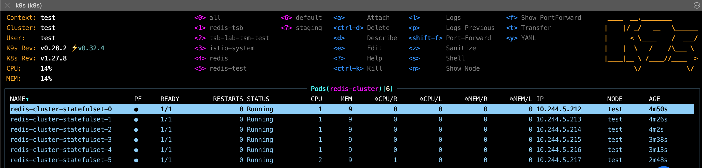
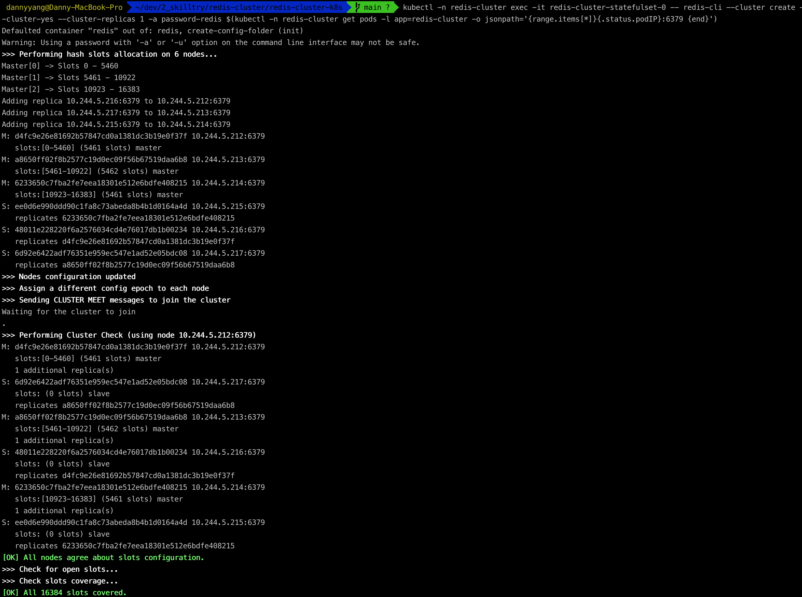

# 如何初始 Redis Cluster

本範例將提供快速建立Redis Cluster 於 K8s 範例

請先建立namespace 
```shell
kubectl create namespace redis-cluster
```

部署Yamls
```shell
kubectl -n redis-cluster apply -f deploy/
```

等待6個pod都部署完成，且為running



執行以下指令
```shell
kubectl -n redis-cluster exec -it redis-cluster-statefulset-0 -- redis-cli --cluster create --cluster-yes --cluster-replicas 1 -a password-redis $(kubectl -n redis-cluster get pods -l app=redis-cluster -o jsonpath='{range.items[*]}{.status.podIP}:6379 {end}')
```

redis cluster 建立完成



# Disclaimer
裡面的Redis config 與 storage class 請依據各別cluster配置做參考，不建議直接使用在Production 環境